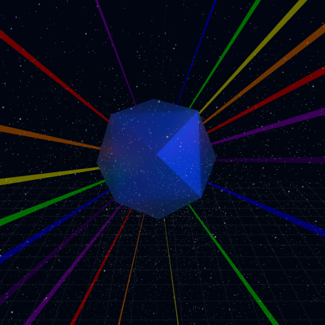

# Rainbo-Cube 🌈🔲

Experience the magic of 3D with Rainbo-Cube, a mesmerizing web-based 3D visualization. Built with modern web technologies, dive into a vibrant universe filled with dynamic interactions.

[Check out the live application](https://rainbo-cube.web.app/).



## Features

- **Interactive 3D Visualization:** Engage with a captivating 3D scene that responds to user interactions.
- **Dynamic Lighting:** Experience the play of light and shadow, bringing depth and life to the visualization.
- **Responsive Design:** Seamlessly adapts to different screen sizes and devices.

## Development

Rainbo-Cube is built using Vite, harnessing the power of modern frontend tooling.

## Getting Started

- Clone the repository:
```bash
git clone https://github.com/your-username/rainbo-cube.git  <!-- Replace with your repo URL -->
cd rainbo-cube
```

- Install dependencies:
```bash
npm install
```

- Run the development server:
```bash
npm run dev
```

## Other Scripts

- Build for Production: `npm run build`
- Preview Build: `npm run serve`
- Linting: `npm run lint`
- Code Formatting: `npm run format`
- Deploy to Hosting: `npm run deploy`

## Contributing

While Rainbo-Cube is primarily a personal project, contributions are always welcome. Feel free to open issues or pull requests if you'd like to improve the application or add new features.